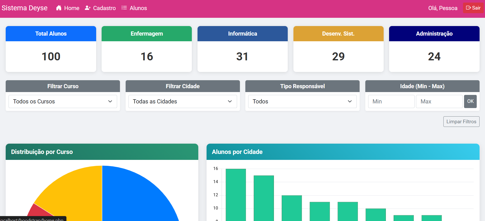
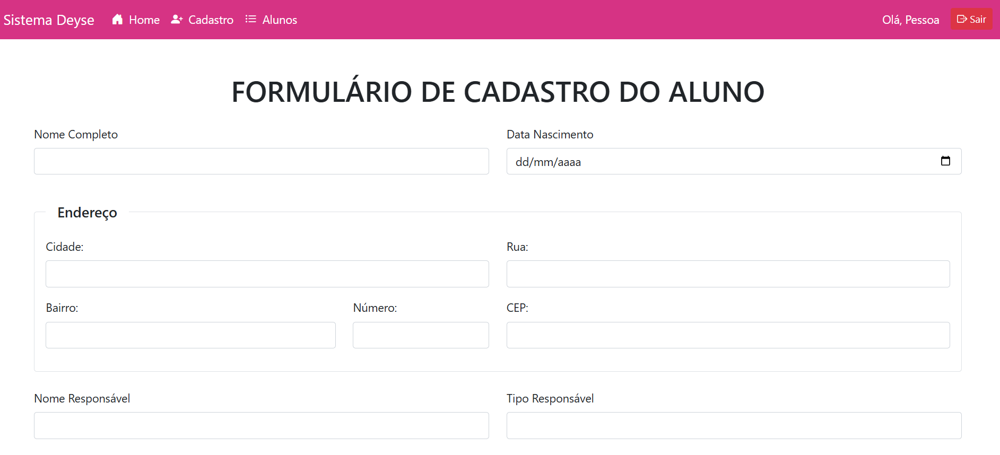
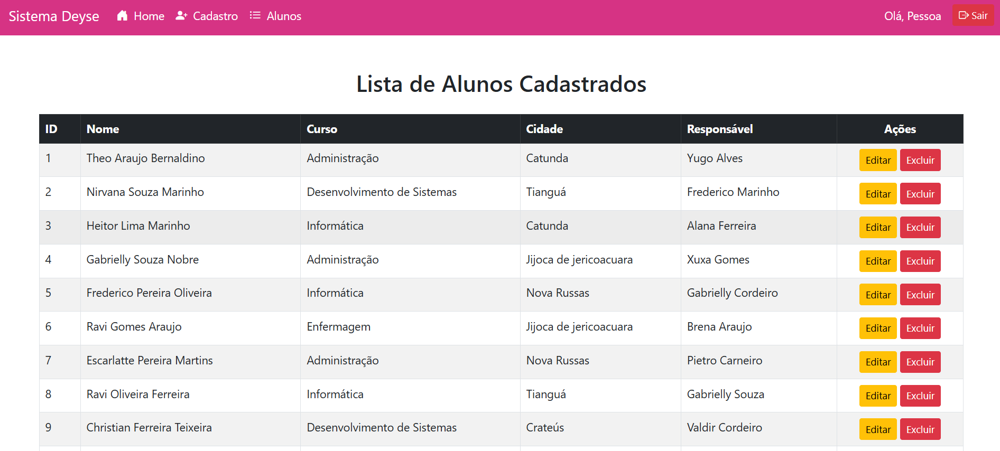
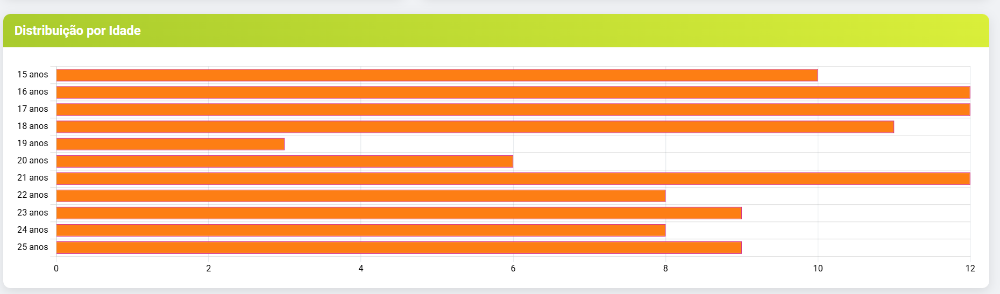

# Sistema de Gestão Acadêmica (SGA)

> **Instituição:** EEEP MANOEL MANO  
> **Curso:** Técnico em Informática  
> **Disciplina:** Banco de Dados  
> **Professor:** Adeilson Sales Aragão

## 💻 Sobre o Projeto

Este projeto consiste no desenvolvimento de uma aplicação web completa para o gerenciamento de dados escolares. O objetivo principal foi criar uma interface capaz de realizar operações de **CRUD** (Create, Read, Update, Delete) em um banco de dados relacional, além de fornecer um **Dashboard Analítico** para visualização de métricas em tempo real.

O sistema foi populado com um script de **Seeding** (preenchimento automático), inserindo mais de 100 registros para validar a performance das consultas e a precisão dos gráficos.

## 🚀 Funcionalidades Principais

1.  **Autenticação Segura:** Sistema de login com validação de sessão e criptografia de senha (MD5).
2.  **Gestão de Alunos:** Formulário de cadastro completo, listagem com paginação e opções de edição/exclusão.
3.  **Dashboard Interativo:** Painel visual com "Cards" (KPIs) e gráficos dinâmicos gerados via **Chart.js**.
4.  **Filtros Avançados:** Capacidade de segmentar dados por Curso, Cidade, Idade e Tipo de Responsável.
5.  **Responsividade:** Interface adaptável a dispositivos móveis utilizando Grid System do Bootstrap.

## 📸 Interface do Sistema

### Página Inicial (Dashboard)
Visão geral com indicadores de desempenho e gráficos estatísticos.

### Cadastro de Alunos
Formulário validado para inserção de novos registros.

### Listagem e Controle
Tabela gerenciável para administração dos dados dos alunos.

---

## 🛠 Tecnologias e Ferramentas

* **Linguagem de Servidor:** PHP 8.0+
* **Banco de Dados:** MySQL
* **Frontend:** HTML5, CSS3, JavaScript (Chart.js)
* **Framework CSS:** Bootstrap 5
* **Ambiente de Desenvolvimento:** XAMPP (Apache)

---

## 🗄 Estrutura do Banco de Dados

O banco de dados foi modelado para garantir a integridade das informações. Abaixo, os scripts SQL utilizados para a criação das tabelas essenciais.

### Tabela de Usuários (Acesso Administrativo)
'''CREATE TABLE users (
    user_id INT AUTO_INCREMENT PRIMARY KEY,
    user_name VARCHAR(100) NOT NULL,
    user_email VARCHAR(150) NOT NULL UNIQUE,
    user_password VARCHAR(255) NOT NULL
);.'''

### Tabela de Alunos (Acesso Geral) 
'''CREATE TABLE alunos (
    id INT AUTO_INCREMENT PRIMARY KEY,
    nome VARCHAR(255) NOT NULL,
    data_nascimento DATE NOT NULL,
    cidade VARCHAR(100),
    rua VARCHAR(255),
    bairro VARCHAR(100),
    numero VARCHAR(20),
    cep VARCHAR(10),
    nome_responsavel VARCHAR(255),
    tipo_responsavel VARCHAR(50),
    curso VARCHAR(100) NOT NULL,
    data_cadastro TIMESTAMP DEFAULT CURRENT_TIMESTAMP
);'''

## 📊 Consultas e Análise de Dados
Para atender aos requisitos do projeto, foram implementadas consultas complexas que alimentam os gráficos e relatórios do sistema. Abaixo, apresentamos 10 cenários de análise possíveis através da nossa interface:

### Filtros e Seleções
A aplicação permite combinar parâmetros para extrair informações específicas.

### Lista de Consultas Realizadas
* Panorama Geral: Quantidade total de matrículas divididas por curso.

* Análise Demográfica (Crateús): Alunos residentes em Crateús separados por curso.
  

* Geolocalização: Distribuição de alunos por municípios de origem.
  

* Foco em Informática: De onde vêm os alunos matriculados no curso de Desenvolvimento de Sistemas.
  
  
* Faixa Etária Global: Histograma de idades de todos os alunos cadastrados.
  

* Faixa Etária (Administração): Perfil de idade específico dos alunos de T.I.
  

* Curso "Campeão": Identificação automática do curso com maior número de inscritos.
* Maior Polo de Alunos: Identificação automática da cidade com mais matrículas.

* Destaque Regional (Crateus): Qual curso é preferido pelos alunos de Jijoca de Jericoacoara.
* Polo de Informática: Cidade que mais envia alunos para o curso de Informática.

📝 Conclusão
O desenvolvimento deste sistema permitiu a aplicação prática de conceitos fundamentais de Engenharia de Software e Banco de Dados. A integração entre o PHP e o MySQL, somada à visualização de dados com JavaScript, resultou em uma ferramenta funcional que simula um ambiente real de gestão escolar. O desafio de popular o banco com dados em massa foi crucial para testar a eficiência das queries SQL.

